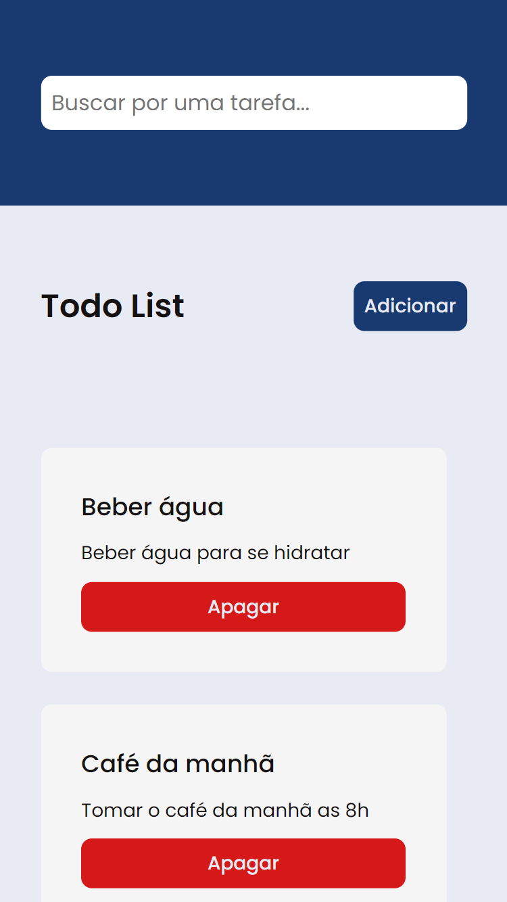
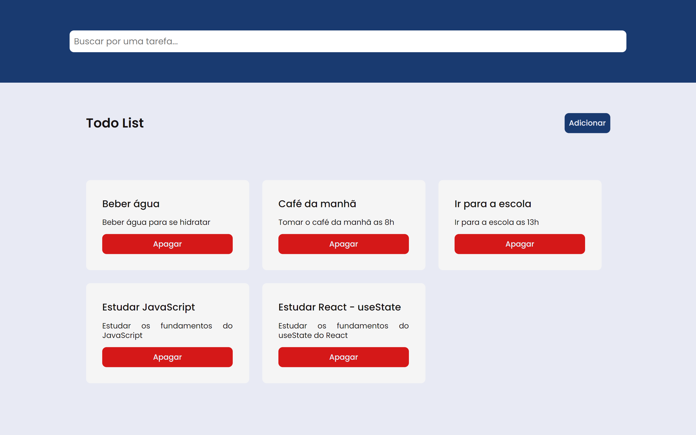

<h1 align="center">Projeto 01 do Curso de Desenvolvimento Web Full Stack do projeto Geração Tech</h1>

<h2>📃 Roteiro</h2>

<ul>
  <li>
    <a href="#sobre">Sobre</a>
  </li>
  <li>
    <a href="#tecnologias">Tecnologias</a>
  </li>
  <li>
    <a href="#requisitos">Requisitos</a>
    <ul>
      <li>
        <a href="#requisitos-funcionais">Requisitos Funcionais (RF)</a>
      </li>
      <li>
        <a href="#regras-de-negocio">Regras de Negócio</a>
      </li>
      <li>
        <a href="#requisitos-nao-funcionais">Requisitos Não Funcionais (RNF)</a>
      </li>
    </ul>
  </li>
  <li>
    <a href="#pre-requisitos">Pré-requisitos</a>
  </li>
  <li>
    <a href="#instalacao">Instalação</a>
  </li>
  <li>
    <a href="#executando">Executando</a>
  </li>
  <li>
    <a href="#deploy">Deploy</a>
  </li>
  <li>
    <a href="#autor">Autor</a>
  </li>
  <li>
    <a href="#licenca">Licença</a>
  </li>
</ul>

<h2>📱 Versão Mobile</h2>

<p align="center">
  <a href="#">
    
  </a>
</p>

<h2>🖥️ Versão Desktop</h2>

<p align="center">
  <a href="#">
    
  </a>
</p>

<h2>❓ Sobre</h2>

<p>Projeto 01 do Curso de Desenvolvimento Web Full Stack do projeto Geração Tech que o objetivo era desenvolver uma lista de tarefas.</p>

<h2>🛠️ Tecnologias</h2>

<ul>
  <li>
    <a href="https://developer.mozilla.org/pt-BR/docs/Web/HTML">HTML</a>
  </li>
  <li>
    <a href="https://developer.mozilla.org/pt-BR/docs/Web/CSS">CSS</a>
  </li>
  <li>
    <a href="https://developer.mozilla.org/pt-BR/docs/Web/JavaScript">JavaScript</a>
  </li>
  <li>
    <a href="https://www.npmjs.com/package/json-server">JSON Server</a>
  </li>
</ul>

<h2>🚀 Requisitos</h2>

<h3>Requisitos Funcionais (RF)</h3>

<ul>
  <li>✅ O usuário deve poder adicionar uma nova tarefa à lista.
</li>
  <li>✅ Cada tarefa deve ter um título e uma descrição obrigatória.</li>
  <li>✅ O usuário deve poder visualizar todas as tarefas adicionadas.</li>
  <li>✅ Cada tarefa deve ter um título e descrição obrigatório. Não é permitido adicionar tarefas sem título e descrição.</li>
  <li>✅ O usuário deve poder filtrar as tarefas.</li>
  <li>✅ As tarefas devem ser armazenadas localmente no dispositivo do usuário, permitindo que sejam mantidas entre sessões.</li>
</ul>

<h3>Regras de Negócio</h3>

<ul>
  <li>✅ Cada tarefa deve ter um título e descrição obrigatório. Não é permitido adicionar tarefas sem título e descrição.</li>
</ul>

<h3>Requisitos Não Funcionais (RNF)</h3>

<ul>
  <li>✅ A aplicação deve carregar e exibir a lista de tarefas em menos de 2 segundos.</li>
  <li>✅ A interface deve ser intuitiva e fácil de usar, permitindo que os usuários adicionem e filtrem tarefas sem dificuldades.</li>
  <li>✅ A aplicação deve ser compatível com os principais navegadores (Chrome, Firefox, Safari e Edge) e dispositivos móveis.</li>
  <li>✅ O código da aplicação deve ser bem documentado e seguir boas práticas de desenvolvimento, facilitando futuras manutenções e melhorias.</li>
</ul>

<h2>📋 Pré-requisitos</h2>

<ol>
  <li>
    Ter instalado um editor de código. Recomendo o <a href="https://code.visualstudio.com/download/">VS Code</a>
  </li>
  <li>
    Ter instalado o <a href="https://git-scm.com/downloads/">Git</a>
  </li>
  <li>
    Ter instalado a extensão <a href="https://marketplace.visualstudio.com/items?itemName=ritwickdey.LiveServer">Live Server</a>
  </li>
  <li>
    Ter instalado o <a href="https://nodejs.org/en/">Node.js</a>
  </li>
</ol>

<h2>🔧 Instalação</h2>

1. Abra o terminal e clone o repositório do projeto:

```bash
git clone https://github.com/pedroeuzebiooo/gt-curso-dwfs-projeto-01
```

<h2>⚙️ Executando</h2>

1. Entre na pasta do projeto clonado:

```bash
cd gt-curso-dwfs-projeto-01
```

2. Abra a pasta do projeto clonado no [VS Code](https://code.visualstudio.com/download/):

```bash
code .
```

3. Instale as dependências do projeto:

```bash
npm install
```

ou

```bash
yarn install
```

ou

```bash
pnpm install
```

4. Execute o projeto:

```bash
npm run dev
```

ou

```bash
yarn run dev
```

ou

```bash
pnpm run dev
```

5. Abra o arquivo `index.html` com a extensão [Live Server](https://marketplace.visualstudio.com/items?itemName=ritwickdey.LiveServer)

<h2>🌐 Deploy</h2>

<li>
  <a href="https://gt-curso-dwfs-projeto-01.vercel.app">Deploy do projeto</a>
</li>

<h2>🧑‍💻 Autor</h2>

<table>
  <tr>
    <td align="center">
      <a href="https://github.com/pedroeuzebiooo">
        
        <br>
        Pedro Euzebio
      </a>
    </td>
  </tr>
</table>

<h2>📝 Licença</h2>

<p>
  O projeto está sob licença MIT. Veja o arquivo <a href="./LICENSE">LICENSE</a> para mais detalhes.
</p>
